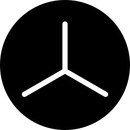
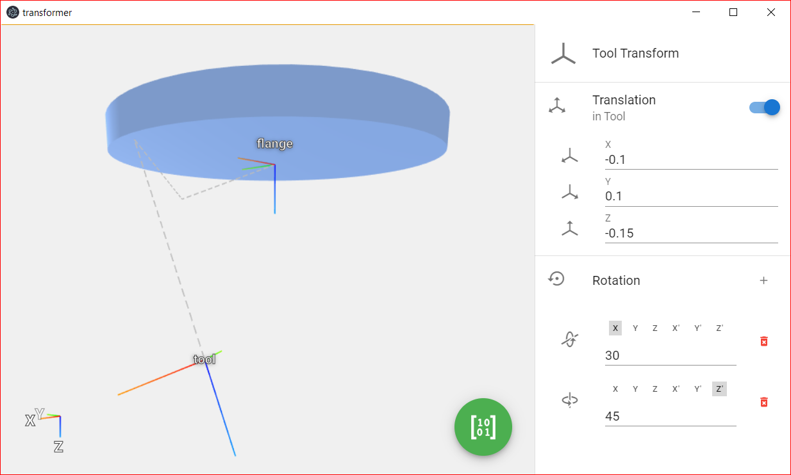

# TCP Transformer
A project providing you with a cross-platform electron app and web-app to get your Flange *to* TCP (Tool-Center-Point) transformations right. *Finally!*

Computes transformation matrix from offset and an arbitrary set of single rotations. Supplies you with:
* Transformation matrix (forward & backwards)
* Quaternions (forward & backwards)
* Euler angles (as you input them)




## setup
```
npm install
```

### running (development)
#### local web application
Will be served at: [http://localhost:8080/](http://localhost:8080/)
```
npm run serve
```

#### electron development
```
npm run electron:serve
```

### bundling / building
#### web application
Will be bundled at `./dist`.
```
npm run build
```

#### binary / electron
Will be built in `./release`.
```
npm run electron:build
```

#### deploy to GitHub-pages
```
npm run gh-pages:deploy
```
